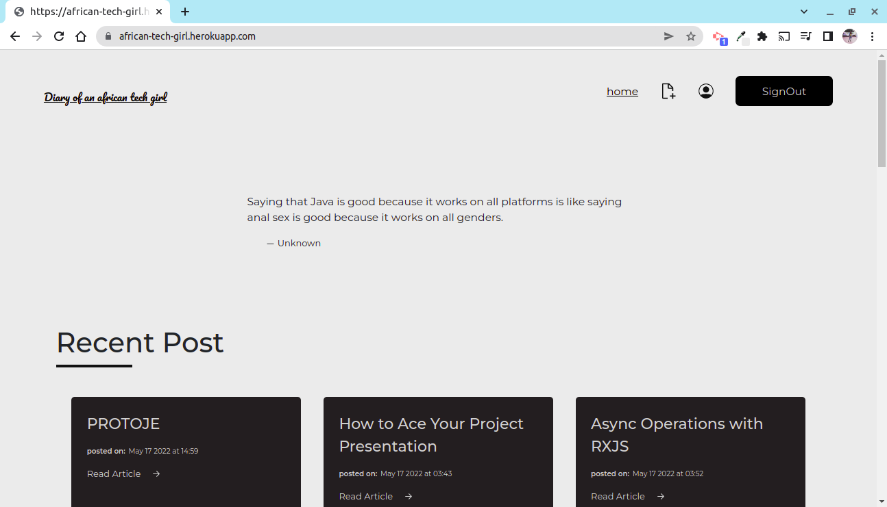

# blog
## Table of Content

- [Description](#description)
- [Installation Requirement](#Installation)
- [Technology Used](#technology-used)
- [Reference](#reference)
- [Licence](#licence)
- [Authors Info](#author-Info)
- [ToDO](#To-Do)

 

<h1>Home Page</h1>

 

 
 

## Description

This is a personal blog sample that allow users to comment to blogs that I have posted 

LOGIN as admin username:_nyanchera password:aaaaaaaa to be able to test posting

See Live site <a href="https://african-tech-girl.herokuapp.com/">here</a>

## Installation

<code>
<ul>
<li>Git clone This repo.</li>
<li>python3 -m venv virtual - to install virtual enviroment.</li>
<li>pip install -r requirements.txt - to install dependenicies.</li>
<li>pip list to show all needed packages are installed inside the virtual environment.</li>

</ul>
</code>

## Technology Used

<ul>
<li>
python3.9.5
 </li>
  <li>
Flask 2.0.0
 </li>
<li>
pip3
</li>
<li>
PSQL 
</li>
<li>
Javascript
</li>
</ul>

## Reference

- <a href="https://flask.palletsprojects.com/en/2.1.x/">FLASK Documentation - https://flask.palletsprojects.com/en/2.1.x/</a>

## Licence

   copyright © Charity 2022 - <a href="https://github.com/charity-bit/blog/blob/main/LICENSE"> MIT </a>

## Authors Info

-LinkedIn - [Charity Nyanchera](https://www.linkedin.com/in/charitynyanchera)

-twitter - [CcNyanchera](https://twitter.com/CcNyanchera)

-[Go Back to the top](#pitch)
